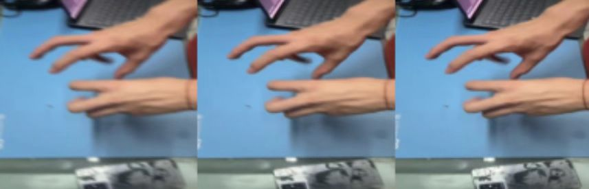
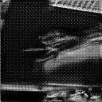

# 动态模糊图像去模糊项目 / Dynamic Motion Deblurring

## 项目简介 / Introduction

本项目旨在实现动态图像（如视频帧）去模糊，包含多种去模糊模型的训练、测试与数据处理工具。适用于学术研究、工程应用或相关领域的开发者参考与二次开发。

This project focuses on dynamic motion deblurring for images and video frames. It provides tools for dataset generation, model training, testing, and visualization. Suitable for academic research, engineering applications, and further development.

---

## 主要功能 / Main Features

- 多种去模糊神经网络模型的实现与训练（如创新型模型、GAN、固定卷积等）
- 支持自定义模糊数据集的生成与处理
- 提供完整的训练、测试、可视化流程
- 代码结构清晰，易于扩展和修改

---

## 目录结构 / Directory Structure

- `models/`：神经网络模型定义 / Model definitions
- `train_*.py`：不同模型的训练脚本 / Training scripts for different models
- `test_*.py`：模型测试与评估脚本 / Testing and evaluation scripts
- `generate_blur.py`、`dynamic_blur(创建模糊数据集).py`：模糊数据集生成 / Blur dataset generation
- `preprocess_images（裁剪图片）.py`、`extract_frames（提取视频帧）.py`：数据预处理 / Data preprocessing
- `plot_metrics.py`、`visualize_network.py`：结果可视化 / Visualization
- `requirements.txt`：依赖库列表 / Dependency list

---

## 快速开始 / Quick Start

### 1. 安装依赖 / Install Dependencies

```bash
pip install -r requirements.txt
```

### 2. 数据准备 / Data Preparation

- 使用 `extract_frames（提取视频帧）.py` 提取视频帧
- 使用 `dynamic_blur(创建模糊数据集).py` 或 `generate_blur.py` 生成模糊图像

### 3. 训练模型 / Train Models

以创新型模型为例 / For innovative model:

```bash
python train_innovative.py
```

或训练其他模型 / Or train other models:

```bash
python train_gan.py
python train_fixed固定卷积.py
python train_single_scale单尺度注意力.py
```

### 4. 测试与评估 / Test and Evaluation

```bash
python test_model(对三个模型测试).py
```

### 5. 结果可视化 / Visualization

```bash
python plot_metrics.py
python visualize_network.py
```

---

## 结果展示 / Results

### 模型对比结果 / Model Comparison Results

下图展示了不同模型的去模糊效果对比：



### 去模糊处理过程 / Deblurring Process

下图展示了图像去模糊的处理过程：



---

## 依赖环境 / Requirements

- Python 3.7+
- 详见 `requirements.txt` / See `requirements.txt`

---

## 贡献 / Contributing

欢迎提交 issue 或 pull request 以改进本项目！

Contributions are welcome via issues or pull requests.

---

## 许可证 / License

本项目遵循 MIT 许可证。

This project is licensed under the MIT License. 